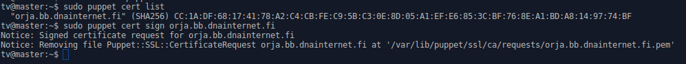
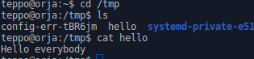
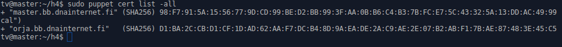
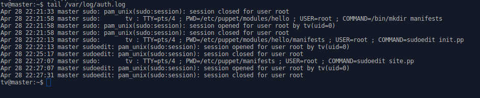
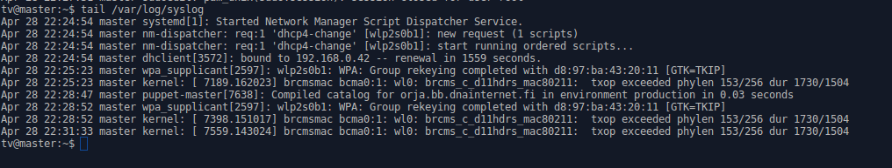
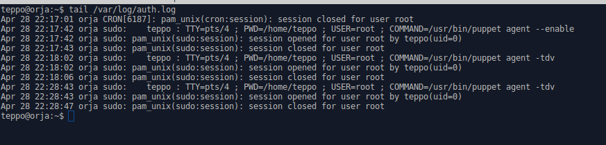
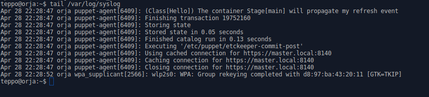

# h4

## Haaga-Helia, Palvelinten hallinta ict4tn022-2, uusi OPS - 5 op

Tehtävä h4:n toimeksianto löytyy osoitteesta http://terokarvinen.com/2017/aikataulu-%e2%80%93-palvelinten-hallinta-ict4tn022-2-%e2%80%93-5-op-uusi-ops-loppukevat-2017-p2.

Tehtävässä tuli tehdä yhdestä koneesta herra ja toisesta orja. Orjan tuli saada herralta puppet-moduli. Tehtävä tuli aloittaa tyhjillä koneilla.

Toteutin harjoituksen kahdella kannettavalla tietokoneella omassa kotiverkossa. Aluksi asensin molempiin koneisiin käyttöjärjestelmäksi Xubuntu 16.04.1 LTS "Xenial Xerus" - Release amd64. 

Herra: Dell Latitude E6420, jossa Intel Core i5 ja 4 Gt RAM.

Orja: Sony Vaio VPCEA2S1E, jossa Intel Core i3 ja 4 Gt RAM.

## Koneiden välisen yhteyden testaus

Selvitin molempien koneiden IP-osoitteen komennolla 

	$ ifconfig

Vastaukseksi sain herra = 192.168.0.42 ja orja = 192.168.0.16

Testasin yhteyksiä IP-osoitteilla

Herralla annoin komennon

	$ ping 192.168.0.16

Yhteys toimi

Orjalla annoin komennon

	$ ping 192.168.0.42

Yhteys toimi

Tämän jälkeen loin molemmille koneille .local -osoitteen 

Herralle loin osoitteen master.local

	$ sudoedit /etc/hosts

Muutin tiedostosta yhden rivin muotoon 

	 127.0.1.1	master master.local

Orjalle loin osoitteen orja.local

        $ sudoedit /etc/hosts

Muutin tiedostosta yhden rivin muotoon

         127.0.1.1      orja orja.local

Testasin uudelleen koneiden väliset yhteydet.

Herralla annoin komennon

	$ ping orja.local

Yhteys toimi.

Orjalla annoin komennon

	$ ping master.local

Yhteys toimi.

## Herran luominen (Dell)

Hain päivitykset

        $ sudo apt-get update

Asensin puppetmasterin

	$ sudo apt-get install puppetmaster

Lisäsin puppet.conf tiedostoon rivin (herran nimi) [master] otsikon alle

	$ sudoedit /etc/puppet/puppet.conf
	
	dns_alt_names = master.local	

Pysäytin puppetmasterin

	$ sudo service puppetmaster stop

Poistin luomisen yhteydessä asentuneet sertifikaatit

	$ sudo rm -r /var/lib/puppet/ssl

Käynnistin puppetmasterin uudelleen

	$ sudo service puppetmaster start

Herra oli nyt luotu.

## Orjan luominen (Sony)

Hain päivitykset

        $ sudo apt-get update

Asensin puppetin

        $ sudo apt-get install puppet

Lisäsin puppet.conf tiedostoon rivin (herran DNS-nimi) [agent] otsikon alle

        $ sudoedit /etc/puppet/puppet.conf

        [agent]
	server = master.local

Käynnistin puppetin uudelleen

        $ sudo service puppet restart

Orja oli nyt luotu.

## Orjan sertifikaatin allekirjoittaminen herralla

Herra koneella annoin komennot

	$ sudo puppet cert list

Orjan sertifikaatti tuli näkyviin. Allekirjoitin sen

	$ sudo puppet sign orja.bb.dnainternet.fi

Allekirjoitus onnistui ilman virheilmoituksia.

## Modulin luonti herra koneelle

Loin puppet-modulin seuravasti

	$ cd /etc/puppet/modules
	$ sudo mkdir hello
	$ cd hello
	$ sudo mkdir manifests
	$ cd manifests
	$ sudoedit init.pp

Modulin sisällöksi tein yksikertaisen 'Hello Word' modulin, jolla voi yksinkertaisesti testata saako orja herralta modulin.

	class hello {
		file {'/tmp/hello':
			content => "Hello everybody\n",
		}
	}

Loin Site manifestin

	$ cd /etc/puppet/manifests
	$ sudoedit site.pp

Site manifestin sisältö

	class {'hello':}

## Testasin toimivuutta, eli saako orja herralta 'Hello Word' modulin.

Orja koneella annoin komennot

	$ sudo puppet agent -tdv

Sain ilmoituksen, että pitää antaa komento puppet agent --enable. Annoin sen

	$ sudo puppet agent --enable

Annoin uudelleen komennon

	$ sudo puppet agent -tdv

Modulin haku meni läpi ilman virheilmoituksia.

Tarkastin toimiko moduli.

	$ cd /tmp
	$ cat hello

Moduli toimi. Todisteena kuvakaappaus terminalista.

## Lähteet

Tero Karvisen opetus palvelinten hallinnan oppitunneilla

Tero Karvisen laatimat ohjeet Puppetmaster on Ubuntu 12.04. Ohjeet luettavissa http://terokarvinen.com/2012/puppetmaster-on-ubuntu-12-04.

## Vaaditut loki ym. tiedot

Masterilta haetut sertifikaatit

	$ sudo puppet cert list -all

Masterilta haettu

	$ tail /var/log/auth.log

Masterilta haettu 

	$ tail /var/log/syslog

Orjalta haettu

	$ tail /var/log/auth.log

Orjalta haettu

	$ tail /var/log/syslog

